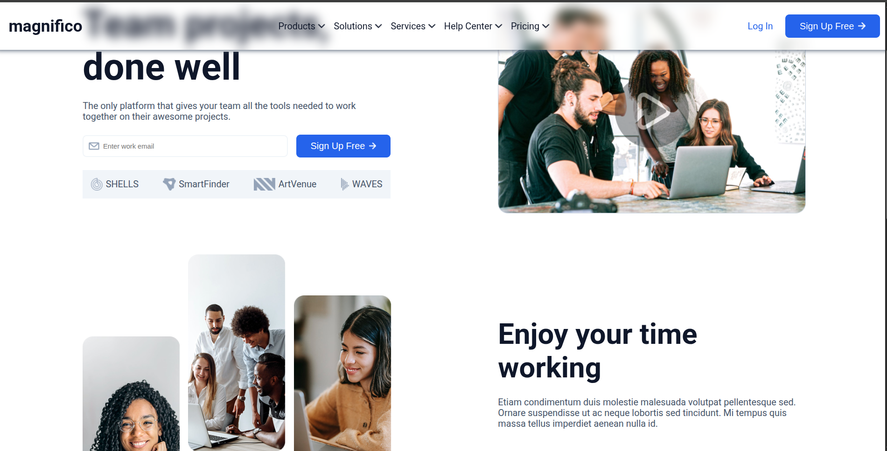
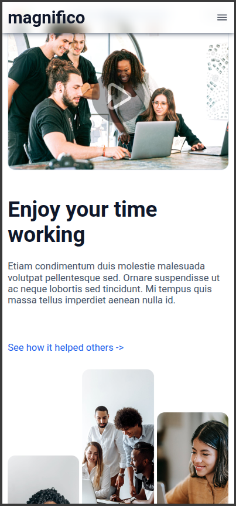

# Landing page | Andoh_Erika_Merveille

## 1. DESCRIPTION
Dans le cadre de la formation Developpement web full stack (**WORK ET YAMO**), il a été question de faire un travail de groupe constitué de 3 personne afin de produire la version codée d'un design figma.

#### NOM DES MEMBRES DU GROUPE
- ANDOH
- ERIKA
- MERVEILLE

#### ERCHITECHTURE DU PROJET

```
.
├── assets
│   ├── css
│   │   ├── index.css
│   │   └── style.css
│   └── images
│       ├── chevron-down.png
│       ├── envelope.png
│       ├── flèche.png
│       ├── fleche.zip
│       ├── Group 45.png
│       ├── Group 46.png
│       ├── Icons.png
│       ├── image-hero.png
│       ├── Left (1).png
│       ├── Menu amberger.png
│       ├── Montgolfière.jpg
│       ├── Picture (1).png
│       ├── Picture (2).png
│       ├── Picture.png
│       ├── sphere.svg
│       ├── Vector (1).png
│       └── Vector.png
├── index.html
└── README.md

```

#### DIFFÉRENTES BRANCHES DU PROJET

    - origin/Andoh
    - origin/ERIKA-PART
    - origin/andoh
    - origin/main

## 2. INSTALLATION

pour installer notre projet suives les étapes suivantes:

- Ouvrir le terminal
- Copier et coller cette commande: 

```bash
git clone git@github.com:Worketyamo-Students/Landing-page-ANDOH-ERIKA-MERVIE.git
```

## 3. APPERÇU

Voici un petit appercu de notre projet

- ### Sur desktop



- ### Sur mobile



## 4. Contact

Pour toutes vos différentes questions, contactez moi:

- # [Whatsapp](https://wa.me/+237698735802)
- # <a href="mailto:andohjeanfrancois7@gmail.com">Mail</a>